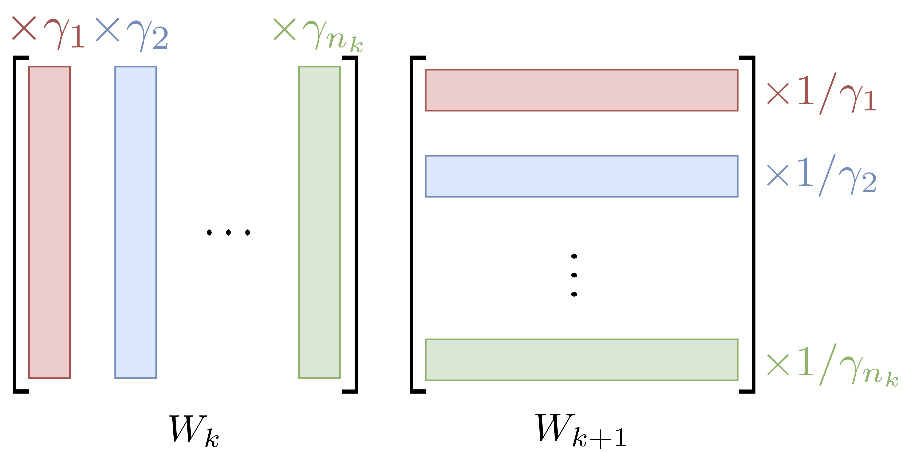

# Equi-normalization of Neural Networks
 ENorm is a fast and iterative method for minimizing the L2 norm of the weights of a given neural network that provably converges to a unique solution.  Interleaving ENorm with SGD during training improves the test accuracy.

This repository contains the implementation of ENorm as detailed in our paper [Equi-normalization of Neural Networks](https://arxiv.org/abs/1902.10416) (ICLR 2019). The library is easy to use and requires adding only two lines of code to your usual training loop.

<p align="center">
</p>


## Dependencies
ENorm works with Python 3.6 and newest. To run the code, you must have the following packages installed:
- [NumPy](http://www.numpy.org/)
- [PyTorch](http://pytorch.org/) (version>=0.4)

These dependencies can be installed with:
`
pip install -r requirements.txt
`

Optionally, you can use the Anaconda package manager as follows:
- Create a new environment: run `conda env create -f environment.yml` followed by `source activate enorm`
- Update your current environment: run `conda update -f environment.yml`

## How to use ENorm

The training procedure consists in performing one ENorm cycle (iterating ENorm on the entire network once) after each SGD step as detailed below.
```python
from enorm import ENorm


# defining model and optimizer
model = ...
criterion = ...
optimizer = torch.optim.SGD(model.parameters(), lr=0.1, momentum=0.9 weight_decay=1e-4)

# instantiating ENorm (here with asymmetric scaling coefficient c=1)
enorm = ENorm(model.named_parameters(), optimizer, c=1)

# training loop
for batch, target in train_loader:
  # forward pass
  output = model(input)
  loss = criterion(output, target)

  # backward pass
  optimizer.zero_grad()
  loss.backward()

  # SGD and ENorm steps
  optimizer.step()
  enorm.step()
```
Some precisions about the usage of ENorm (for details, see [our paper](https://arxiv.org/abs/1902.10416)):
- ENorm is compatible with feedforward fully connected and/or convolutional architectures with ReLU and pooling layers.
- The asymmetric scaling coefficient c penalizes the layers exponentially according to their depth. Usually, values of c equal to or slightly above 1 give the best results.
- Currently, only the SGD optimizer is supported due to the momentum buffer update. Indeed, with using momentum, ENorm performs a jump in the parameter space, thus we update the momentum accordingly.
- Optionally, one can perform more ENorm cycles or apply ENorm every k SGD iterations (k > 1). In our experience, performing one ENorm cycle after each SGD iteration generally works best.
- In practice, we have found the training to be more stable when *not* balancing the biases.
- When applying ENorm to a network with BatchNorm layers, we simply ignore the BatchNorm weights and perform the ENorm cycle on the network as usual.
- Use the documentation of the file `enorm.py` file to adapt ENorm to your favourite network architecture.

## Results
You can reproduce the results of our paper by running the following commands:
```bash
# fully connected network on CIFAR10 with 15 intermediary layers
python main.py --dataset cifar10 --model-type linear --n-layers 15 --enorm 0 --epochs 60 --lr 0.1 --weight-decay 1e-3 --momentum 0 --n-iter 5
python main.py --dataset cifar10 --model-type linear --n-layers 15 --enorm 1.2 --epochs 60 --lr 0.1 --weight-decay 1e-3 --momentum 0 --n-iter 5

# fully convolutional network on CIFAR10
python main.py --dataset cifar10 --model-type conv --enorm 0 --epochs 128  --lr 0.05 --weight-decay 1e-3 --momentum 0.9 --n-iter 5
python main.py --dataset cifar10 --model-type conv --enorm 1.1 --epochs 128 --lr 0.05 --weight-decay 1e-3 --momentum 0.9 --n-iter 5
```

## License
ENorm is released under Creative Commons Attribution 4.0 International (CC BY 4.0) license, as found in the LICENSE file.

## Bibliography
Please consider citing [[1]](https://arxiv.org/abs/1902.10416) if you found the resources in this repository useful.

[1] P. Stock, B. Graham, R. Gribonval and H. Jégou. [Equi-normalization of Neural Networks](https://arxiv.org/abs/1902.10416).
```
@inproceedings{stock2018enorm,
  title = {Equi-normalization of Neural Networks},
  author = {Stock, Pierre and Graham, Benjamin and Gribonval, Rémi and Jégou, Hervé},
  booktitle = {International Conference on Learning Representations (ICLR)},
  year = {2019}
}
```
